# 02 - Site Architecture

## Recommended sitemap

```mermaid
graph TD
    Home[Home Sauna Guide]
    Home --> SaunaHub[Home Saunas]
    Home --> OutdoorHub[Outdoor Saunas]
    Home --> PortableHub[Portable Saunas]
    Home --> DiyHub[DIY Sauna Builds]
    Home --> RecoveryHub[Recovery Adjacent]

    SaunaHub --> BestHome[Best Home Sauna]
    SaunaHub --> InfraredHome[Best Infrared Sauna for Home]
    SaunaHub --> InfraTraditional[Infrared vs Traditional Sauna]
    SaunaHub --> Benefits[Infrared Sauna Benefits]

    OutdoorHub --> BestOutdoor[Best Outdoor Sauna]
    OutdoorHub --> Barrel[Best Barrel Sauna]
    OutdoorHub --> OutdoorInfrared[Best Outdoor Infrared Sauna]

    PortableHub --> Portable[Best Portable Sauna]
    PortableHub --> Blanket[Best Sauna Blanket]
    PortableHub --> PortableInfrared[Best Portable Infrared Sauna]

    DiyHub --> Heater[Best Sauna Heater]
    DiyHub --> Kit[Best Sauna Kit]
    DiyHub --> Temperature[Sauna Temperature Guide]

    RecoveryHub --> Contrast[Contrast Therapy at Home]
    RecoveryHub --> RedLight[Red Light Therapy at Home]
    RecoveryHub --> ColdPlunge[Cold Plunge Expansion Later]
```

## URL pattern

Use stable, simple URLs:

- `/home-sauna/`
- `/outdoor-sauna/`
- `/portable-sauna/`
- `/sauna-heater/`
- `/sauna-kit/`
- `/infrared-vs-traditional-sauna/`
- `/red-light-therapy-at-home/`
- `/contrast-therapy-at-home/`

Avoid dated URLs such as `/best-home-sauna-2026/`. Use visible updated dates on the page instead.

## Internal linking rules

- Every page links up to its hub or parent topic.
- Every commercial page links to 2-4 closely related comparison/support pages.
- Informational health pages link to commercial pages only when the next step is natural.
- Red light and cold plunge pages should link back to sauna pages as adjacent tools, not replace the core sauna journey.

## First hubs

1. Home Sauna Hub
2. Outdoor Sauna Hub
3. Portable Sauna Hub
4. DIY Sauna Hub
5. Recovery Adjacent Hub, launched later
